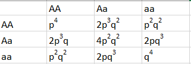
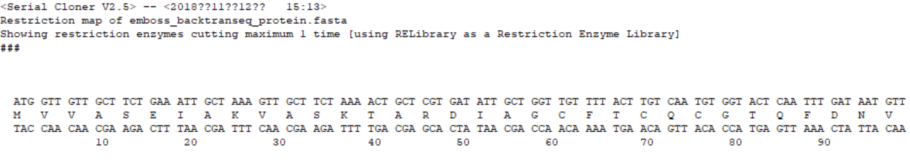
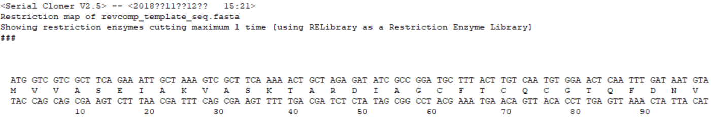
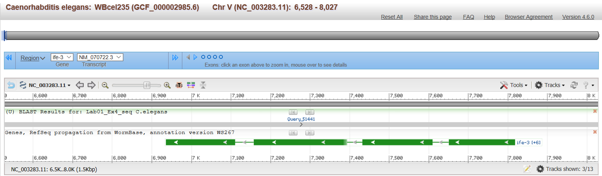
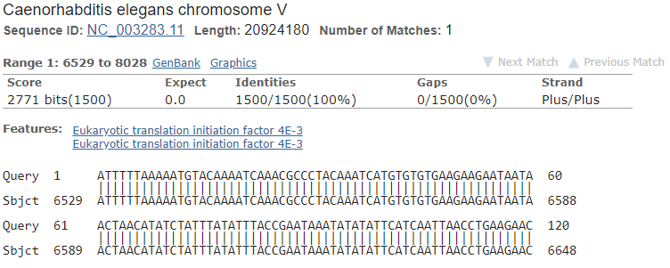
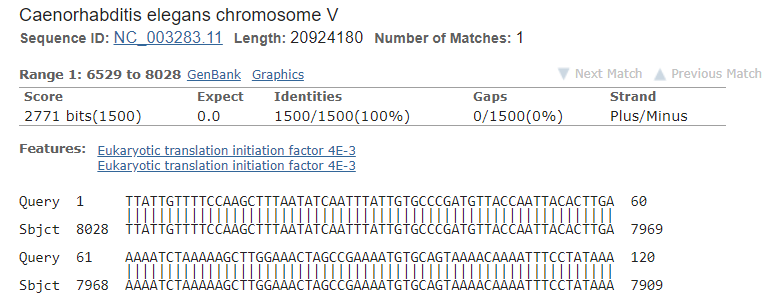
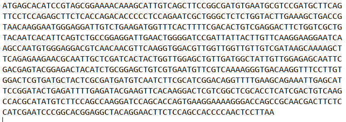
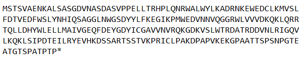
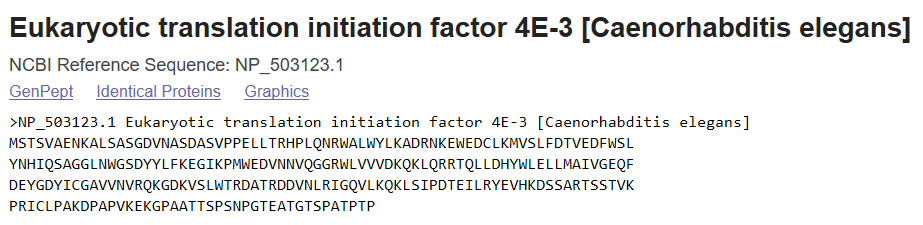

```{r setup, include=FALSE}
knitr::opts_chunk$set(echo = TRUE)
```

## Question 1: Hardy-Weinberg equilibrium

### 1.1

The Hardy-Weinberg equilibrium equation is $p^2 + 2pq + q^2 = 1$.

```{r echo=FALSE}

```


Frequency of AA-homozygotes is $p^2$ 
$$
\begin{aligned}
f(AA) =& p^4*q + p^3*q + p^3*q + p^2*q^2 \\
      =& p^4 + 2*p^3*q +p^2*q^2 \\
      =& p^2(p^2 + 2*p*q +q^2)\\
      =& p^2(1)\\
      =& p^2
\end{aligned}
$$      

Frequency of aa-homozygotes is $q^2$

$$
\begin{aligned}
f(aa) =& p^2*q^2 + p*q^3 + p*q^3 + q^4\\
      =& p^2*q^2 + 2*p*q^3 + q^4 \\
      =& q^2(p^2 + 2*p*q + q^2)\\
      =& q^2(1)\\
      =& q^2
\end{aligned}
$$      

Frequency of Aa-heterozygotes is $2pq$

$$
\begin{aligned}
f(Aa) =& p^3q + 2p^2q^2 + pq^3\\
      =& 2pq(p^2 + 2pq +q^2)\\
      =& 2pq(1)\\
      =& 2pq 
\end{aligned}
$$ 

$f(AA) +f(Aa) +f(aa) = p^2 +2*p*q + q^2 = 1$

$f(A) = f(AA)+1/2f(Aa)=p^2+1/2*2pq=p(p+q)=p$

$f(a) = f(aa)+1/2f(Aa)=q^2+1/2*2pq=q(p+q)=q$

Hence with this equation we can say, with random mating, a population ever deviates from
Hardy-Weinberg equilibrium.


      
### 1.2


chi-square test to test if the population is in Hardy-Weinberg equilibrium

Given values n= 1000, MM=357, NN=158, MN=485

Allele frequencies are calculated
$$
\begin{aligned}
p =& 2*Obs(MM) + Obs(MN)/2*(Obs(MM) + Obs(MN) + Obs(NN)) \\
  =& 2*357 +485/2*(357+485)/2*(357+485+158) \\
  =& 714+485/2*(1000) \\
  =& 1,199/2000\\
  =& 0.5995
\end{aligned}
$$ 

$$
\begin{aligned}
q =& 1-p\\
  =& 1-0.5995\\
  =& 0.4005
\end{aligned}
$$ 

Hardy-Weniberg Expectation
$E(MM) = p^2*n = 0.35940025*1000 = 359.40025$
$E(MN) = 2*p*q*n = 2*0.5995*0.4005*1000 = 480.1995$
$E(NN) = q^2*n = 0.16040025*1000 = 160.40025$


Pearson's chi-squared test
$$
\begin{aligned}
\chi^2 =& \sum(O-E)^2/E\\
    =& (357-359.0425)^2/359.40 + (485-480.19925)^2/480.19 + (158-160.40025)^2/160.40\\
    =& 0.01606 +0.0479 + 0.0359\\
    =& 0.09986\\
    =& 0.1
 \end{aligned}
$$ 

The 5% significance level for 1 degree of freedom is 3.84, and since the $\chi^2$ value is less than this, the null hypothesis that the population is in Hardy-Weinberg frequencies is not rejected.

## Question 2: Exploring a genomic sequence

### 2.1

According to the requirement, we get the nucleotide sequence of CU329670 from GenBank. It is the **chromosome I** from **Schizosaccharomyces pombe**. The protein created by the CDS from 1 to 5662 nucleotides of such sequence is **RecQ type DNA helicase, partial [Schizosaccharomyces pombe]**, and its protein ID is CAC05745.1.

### 2.2

Based on the translation sequence of the protein, the first four amino acids are Methionine (M), Valine (V), Valine (V) and Alanine (A).

### 2.3

Opened by *SerialCloner*, Figure 1 shows a part of nucleotide sequence back-translated from protein translation sequence in **emboss_backtranseq_protein.fasta**. 

```{r echo=FALSE,out.width="450px", out.height="100px"}

```

### 2.4

Figure 2 is a part of reversing complement of original nucleotide sequence in **revcomp_template_seq.fasta**.

```{r echo=FALSE,out.width="450px", out.height="100px"}

```

Although these two nucleotide sequences are different to some extents, but their translation sequences are the same, which means their amino acids are the same. In additional, the back-translated sequence (5661 elements) is shorter than the original one (5662 elements) since there are only 1887 amino acids in the protein, the remaining nucleotide cannot creates any amino acid by itself.

### 2.5

The nucleotide number range of that corresponds to the protein sequence is from 2 to 5662, which creates 1887 amino acids totally. There is no stop codon in the nucleotide sequence since the CDS on the **chromosome I** we get from GenBank only shows the nucleotides sequences where the amino acids can be producted, but stop codon cannot create any amino acids.


## Question 3: Exploring a genomic sequence

### 3.1 About Caenorhabditis elegans  (C.elegans)

Caenorhabditis elegans is a small, free-living, nematode worm, either male or hermaphrodite (have both male and female reproductive organs), which has become established as a standard model organism for a great variety of genetic investigations, being especially useful for studying developmental biology, cell biology and neurobiology.

**C.elegans are important to study Developmental Biology and Genetics for a variety of reasons:**

1. One of the simplest organism with a nervous system.
2. Genetic Manipulations are relatively easy (We can silence any gene by actually feeding them RNAi bacteria).
3. Many of the genes in the C. elegans genome have functional counterparts in humans which makes it an extremely useful model for human diseases.
4. Transparent body for easy developmental studies.
5. Short life span to study aging and neurodegeneration.
6. Each of their germ cells are completely mapped to final differentiation.
7. Easy to grow in bulk populations and the whole Genome has been sequenced.
8. About 35% Genes have Human Homologs.
9. Survived the Space Shuttle Columbia Disaster in 2003!
10. C. elegans mutants can be screened with thousands of potential drugs for important diseases.
11. Studying cell death or 'apoptosis' in the C. elegans could hold the key to counteracting the effects of ageing in humans as well as providing clues about cancer?, diabetes? and other diseases.
12. Although C. elegans is a relatively simple organism, many of the molecular signals controlling its development are also found in more complex organisms, like humans.

### 3.2 

Using the nucleotide BLAST tool, a schematic diagram that shows the arrangement of introns and exons in the genomic sequence has been constructed. There seems exons with different cds range. Bit score=2771.09 with score=1500 for gene ife-3.

```{r , fig.height=5, fig.width=1, out.width = "450px", echo=FALSE}

```

### 3.3

```{r echo=FALSE}
## [Numbering of sequences](3.3_1.png)

```

The database genomic sequence progress in the same direction as the query sequence because there was 0% of gaps and the sequence achieved 100% identity. The hit range is 6,529 >> 8,028 (+). The forward primer (query nucleotides 1..1500) aligns to the sequence NC_003283.11 on the forward strand (indicated by Strand Plus/Plus) at nucleotides 6529..8028. 
The query sequence is reverse complemented using "http://www.bioinformatics.nl/cgi-bin/emboss/revseq" and the same step is repeated.

```{r echo=FALSE}
## 

```

Now, the status of strand is Plus/Minus and the hit range is 6,529 << 8,028 (-). Now, again we observed 0% gaps and 100% identity. But the numberings in the alignment have been changed (reversed) since the query sequence was reverse complemented. 

### 3.4

As we see the image in previous step, it is clear that the query sequence is found in chromosome "V" and the position is 6588..7822. 

### 3.5

The DNA code (reverse complemented sequence) of each exon is extracted and combined. DNA code is
```{r echo=FALSE}

```

Using transeq (https://www.ebi.ac.uk/Tools/st/
emboss_transeq/), the protein code of the gene is obtained. Protein code is 

```{r echo=FALSE}

```

We compared this sequence with the database sequence using Genbank. Both the sequences remains same.
```{r echo=FALSE, out.width = "450px"}

```


### 3.6

When we hover over an exon, we can see some links to View GeneID and View WormBase. Some information about the gene is explained below.

##### Link View GeneID:

Gene ID: 178536

Gene symbol: ife-3

Genomic sequence: NC_003283.11

Gene description: Eukaryotic translation initiation factor 4E-3

Gene type: protein coding

Location: chromosome V

Exon count: 4

##### Link View WormBase:

WormBase ID: WBGene00002061

Species: Caenorhabditis elegans

Sequence: B0348.6

Genomic position: V:6588..7822


### Reference

1. https://en.wikipedia.org/wiki/Hardy-Weinberg_principle
2. https://en.wikipedia.org/wiki/Caenorhabditis_elegans

