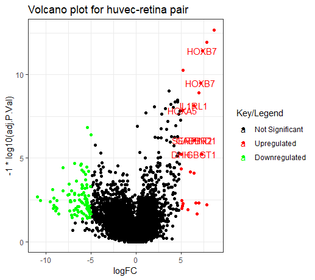

```{r setup, echo=FALSE, warning=FALSE, message=FALSE,include=FALSE}
knitr::opts_chunk$set(echo = FALSE, warning=FALSE, message=FALSE, include=TRUE)
```

\newpage
## Question 2

The three contrasts are as follows,

1. huvec_choroid = huvec - choroid
2. huvec_retina = huvec - retina
3. huvec_iris = huvec - iris

### Present the variables versus each other original variables

All the plots on the left are built on the original data, and all the plots on the right are built on the normalized data

```{r echo=FALSE,out.height = "140px"}
split.screen(c(1,2))
screen(1) 

screen(2) 

split.screen(c(1,2))
screen(3) 
knitr::include_graphics("ori_ih.png")
screen(4) 

split.screen(c(1,2))
screen(5) 

screen(6) 

```

###MA plots

(The first is pre normalized and the second is post normalized)

```{r,out.height = "210px"}

```

```{r,out.height = "210px"}

```

```{r,out.height = "210px"}

```

It seems that all the MA plots are symmetric on the mean of normalized counts (x-axis) for most of points. We can also observe that the lines in the plots refer to the medians and IQR values. According to such six plots, the medians of all the post normalization are 0, which are straight lines in plots and are bigger than the medians of pre normalization. Then the inter quantile ranges (IQR) of post normalization are smaller than the ones of pre normalization. This might be the reason why the red and blue are nearly collide in the post normalization. 

###Cluster Dendrograms and Heat maps

```{r,out.height = "230px"}

```

```{r,out.height = "230px"}

```

```{r,out.height = "230px"}

```

```{r,out.height = "230px"}

```

In first heat map, we can see a cluster range including GSM524669, GSM524667, GSM524670, GSM524668 and GSM524662 with dark blue in color and also see the cluster on the right top including GSM524666 and GSM524663. The big cluster represents a lot of relations between the genes. In second heat map we can see a small cluster range containing GSM524673, GSM524672 and GSM524671 with dark blue on the left bottom. And we can see a small cluster including GSM524669 and GSM524667 on the right top. 

In the cluster dendrogram we can see these clusters hierarchically, but heat map can provide us more details among each pair of two genes. Additionally, the pre normalized cluster dendrogram shows us more relations among different genes except GSM524664 and GSM524673. However, most of such relation disappears in post dendrogram, that is why most of parts are colored in light blue here.

## Question 3

```{r,out.height = "200px"}

```

```{r,out.height = "200px"}

```

```{r,out.height = "200px"}

```

The volcano plots of the differentially expressed genes. Differentially expressed genes were treated with red dots (up-regulated) or green dots (down-regulated), others indicated with blue dots. The red dots are for threshold = 2 and the green dots are for threshold = 3.

###### Volcano plot of huvec Vs Retina
Significantly differentially expressed genes were observed as HOXB7, HOXA5, SOCS2, HOXB6, IL1RL1, DHH, GBGT1. Total genes for huvec-retina pair:

| | | |
|---:|:----|:-----|
|  1  |2   |3   |
|  54557 |24 |94   |

###### Volcano plot of huvec Vs Iris
Significantly differentially expressed genes were observed as HOXB7, HOXA5, SOCS2, HOXB6, IL1RL1, RASORP2. Total genes for huvec-iris pair:

| | | |
|---:|:----|:-----|
|  1  |2   |3   |
|  54601 |25 |49   |

## Question 4

Reporting all the Gene Ontology (GO) terms associated with each gene and describing them:

Gene 1: *HOXB7*

Official Symbol : HOXB7   
Official Full Name : homeobox B7    
Other names : HOX2; HOX2C; HHO.C1; Hox-2.3    
Summary : This gene is a member of Antp homeobox family and encodes a protein with a homeobox DNA-binding domain. It is included in a cluster of homeobox B genes located on chromosome 17. The encoded nuclear protein functions as a sequence-specific transcription factor which is involved in cell proliferation and differentiation. The increased expression of this gene can result in some cases of melanoma and ovarian carcinoma.

GO terms:
```{r echo=FALSE, out.width = "450px"}

```

Gene 2: *SOCS2*

Official Symbol : SOCS2   
Official Full Name : suppressor of cytokine signaling 2   
Other names : CIS2; SSI2; Cish2; SSI-2; SOCS-2; STATI2    
Summary : The SOCS2 gene encodes a member of the suppressor of cytokine signaling (SOCS) family. This family members are cytokine-inducible negative regulators of cytokine receptor signaling via the Janus kinase/signal transducer and activation of transcription pathway (the JAK/STAT pathway). These proteins interact with major molecules of signaling complexes to block further signal transduction by proteasomal depletion of receptors or signal-transducing proteins via ubiquitination. This gene has pseudogenes on chromosomes 20 and 22. Alternative splicing results in multiple transcript variants.

GO terms:
```{r echo=FALSE, out.width = "450px"}
knitr::include_graphics("SOCS2.PNG")
```

Gene 3: *HOXA5*

Official Symbol : HOXA5   
Official Full Name : homeobox A5    
Other names : HOX1; HOX1C; HOX1.3   
Summary : The genes encoding the class of transcription factors called homeobox genes are found in clusters named A, B, C, and D on four separate chromosomes. Expression of these proteins is spatially and temporally regulated during embryonic development. This gene is part of the A cluster on chromosome 7 and encodes a DNA-binding transcription factor which may regulate gene expression, morphogenesis, and differentiation. Methylation of this gene may result in the loss of its expression and, since the encoded protein upregulates the tumor suppressor p53, this protein may play an important role in tumorigenesis.

GO terms: 
```{r echo=FALSE, out.width = "450px"}
knitr::include_graphics("HOXA5.PNG")
```

Gene 4: *IL1RL1*

Official Symbol : IL1RL1    
Official Full Name : interleukin 1 receptor like 1    
Other names : T1; ST2; DER4; ST2L; ST2V; FIT-1; IL33R   
Summary : This gene is a member of the interleukin 1 receptor family. Studies of the similar gene in *mouse* suggested that this receptor can be induced by proinflammatory stimuli, and may be involved in the function of helper T cells. This gene, interleukin 1 receptor, type I (IL1R1), interleukin 1 receptor, type II (IL1R2) and interleukin 1 receptor-like 2 (IL1RL2) form a cytokine receptor gene cluster in a region mapped to chromosome 2q12. Alternative splicing of this gene results in multiple transcript variants.

GO terms:
```{r echo=FALSE, out.width = "450px"}
knitr::include_graphics("IL1RL1.PNG")
```

Gene 5: *GBGT1*

Official Symbol : GBGT1   
Official Full Name : globoside alpha-1,3-N-acetylgalactosaminyltransferase 1 (FORS blood group)    
Other names : FS; A3GALNT; UNQ2513    
Summary : This gene encodes a glycosyltransferase that is significant for the synthesis of Forssman glycolipid (FG), a member of the globoseries glycolipid family. Glycolipids such as FG form attachment sites for the binding of pathogens to cells. The expression of this protein may determine host tropism to microorganisms. Alternative splicing results in multiple transcript variants.

GO terms:
```{r echo=FALSE, out.width = "450px"}
knitr::include_graphics("GBGT1.PNG")
```

From the above description, it is observed that the genes *HOXB7* and *HOXA5* have same GO IDs and GO terms. Both of them are Homeobox protein, but the evidence and pubmed IDs of these genes differ. And also, The GBGT1 has no pubmed IDs for any of its GO IDs.


