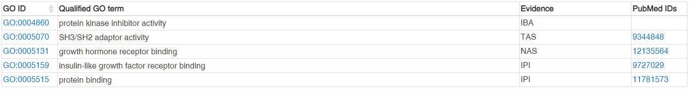
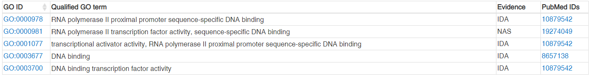
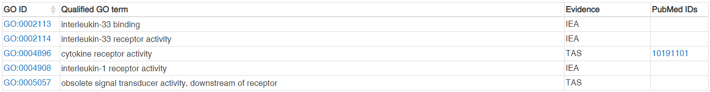
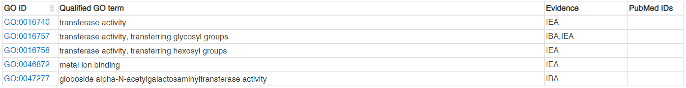

```{r}
summary(results) #To make thresholds
```

```{r}
results$threshold <- "1"
a <- subset(results, adj.P.Val < 0.05 & logFC > 5)
results[rownames(a), "threshold"] <- "2"
b <- subset(results, adj.P.Val < 0.05 & logFC < -5)
results[rownames(b), "threshold"] <- "3"
```
Adding threshold column to the *results* dataframe. Subsetting (filtering) the data based on specified conditions such as * adj.P.Val < 0.05 & logFC > 5 *. Changing the threshold values for these specific conditioned data as "2". Again subsetting the datas and changing threshold value as 3 for these datas. The table shows the threshold values such that, number of objects having threshold as 1 is higher than the other 2 threshold values.


```{r}
library(ggplot2)
volcano <- ggplot(data = results, 
                  aes(x = logFC, y = -1*log10(adj.P.Val), 
                      colour = threshold, 
                      label = getsymbols))

volcano <- volcano + 
  geom_point() + 
  scale_color_manual(values = c("black", "red", "green"), 
                     labels = c("Not Significant", "Upregulated", "Downregulated"), 
                     name = "Key/Legend")

volcano + 
  geom_text(data = subset(results, logFC > 5 & -1*log10(adj.P.Val) > 5), aes(x = logFC, y = -1*log10(adj.P.Val), colour = threshold, label = getsymbols))+
  ggtitle("Volcano plot for huvec-retina pair")+theme_bw()
```
The volcano plot has been created using ggplot(). It plots significance versus fold-change on the y and x axes, respectively. Fold change (x axis) is plotted against statistical significance (y axis) for each set. Genes upregulated with a fold change >=5 and p<0.05 are depicted in red, and those downregulated with a fold change < -5 and p<0.05 are shown in green. Black represents genes in the arrays that were not found to differ significantly. 

```{r}
paste("Total genes for huvec-choroid pair:")
table(results$threshold)
```

When threshold=2, 33 genes (Red) are differentially expressed ones and When threshold=3, 55 (green) genes are differentially expressed ones. So, totally *88 genes* are classified as differentially expressed genes.

## Question 2

The three contrasts are as follows,

1. huvec_choroid = huvec - choroid
2. huvec_retina = huvec - retina
3. huvec_iris = huvec - iris

```{r}
eset <- exprs(celfiles)
samples <- celfiles$Targets
colnames(eset)
# colnames(eset) <- samples
distance <- dist(t(eset), method = "maximum")
clusters <- hclust(distance)
plot(clusters)

eset2 <- exprs(celfiles.gcrma)
colnames(eset2) <- samples
distance2 <- dist(t(eset2), method = "maximum")
clusters2 <- hclust(distance2)
plot(clusters2)


library("gplots")
library("RColorBrewer")
distance
distance2
colors <- colorRampPalette( rev(brewer.pal(9, "Blues")) )(255)
#hc <- hclust(sampleDists)
heatmap.2( as.matrix(distance), Rowv=as.dendrogram(clusters),
           symm=TRUE, trace="none", col=colors,
           margins=c(2,10), labCol=FALSE )

heatmap.2( as.matrix(distance2), Rowv=as.dendrogram(clusters2),
           symm=TRUE, trace="none", col=colors,
           margins=c(2,10), labCol=FALSE )

# Present the variables versus each other original, log-scaled and MA-plot for each considered pair both before and after normalization.

# huvec-choroid MA 
y1 <- eset[, c("choroid", "huvec")]
x1 <- eset2[, c("choroid", "huvec")]

library(affy)
split.screen(c(1,2))
ma.plot( rowMeans(log2(y1)), log2(y1[, 1])-log2(y1[, 2]), cex=1 )
title("Pre Norm (huvec Vs choroid)")
screen(2) 
ma.plot( rowMeans(log2(x1)), log2(x1[, 1])-log2(x1[, 2]), cex=1 )
title("Post Norm (huvec Vs choroid)")

# huvec-iris MA 
y2 <- (eset[, c("iris", "huvec")])
x2 <- (eset2[, c("iris", "huvec")])

split.screen(c(1,2))
ma.plot( rowMeans(log2(y2)), log2(y2[, 1])-log2(y2[, 2]), cex=1 )
title("Pre Norm (huvec Vs iris)")
screen(2)
ma.plot( rowMeans(log2(x2)), log2(x2[, 1])-log2(x2[, 2]), cex=1 )
title("Post Norm (huvec Vs iris)")

# huvec-retina MA 
y3 <- (eset[, c("retina", "huvec")])
x3 <- (eset2[, c("retina", "huvec")])

split.screen(c(1,2))
ma.plot( rowMeans(log2(y3)), log2(y3[, 1])-log2(y3[, 2]), cex=1 )
title("Pre Norm (huvec Vs retina)")
screen(2) 
ma.plot( rowMeans(log2(x3)), log2(x3[, 1])-log2(x3[, 2]), cex=1 )
title("Post Norm (huvec Vs retina)")

```


## Question 3

```{r}
# huvec_retina pair
results1 <- topTable(huvec_ebay, number = 100000, coef = "huvec_retina")
results1 <- cbind(results1, getsymbols)
results1$threshold <- "1"
a <- subset(results1, adj.P.Val < 0.05 & logFC > 5)
results1[rownames(a), "threshold"] <- "2"
b <- subset(results1, adj.P.Val < 0.05 & logFC < -5)
results1[rownames(b), "threshold"] <- "3"

volcano <- ggplot(data = results1, 
                  aes(x = logFC, y = -1*log10(adj.P.Val), 
                      colour = threshold, 
                      label = getsymbols))

volcano <- volcano + 
  geom_point() + 
  scale_color_manual(values = c("black", "red", "green"), 
                     labels = c("Not Significant", "Upregulated", "Downregulated"), 
                     name = "Key/Legend")

volcano + 
  geom_text(data = subset(results1, logFC > 5 & -1*log10(adj.P.Val) > 5), aes(x = logFC, y = -1*log10(adj.P.Val), colour = threshold, label = getsymbols))+
  ggtitle("Volcano plot for huvec-retina pair")+theme_bw()


# huvec_iris pair
results2 <- topTable(huvec_ebay, number = 100000, coef = "huvec_iris")
results2 <- cbind(results2, getsymbols)
results2$threshold <- "1"
a <- subset(results2, adj.P.Val < 0.05 & logFC > 5)
results2[rownames(a), "threshold"] <- "2"
b <- subset(results2, adj.P.Val < 0.05 & logFC < -5)
results2[rownames(b), "threshold"] <- "3"

volcano <- ggplot(data = results2, 
                  aes(x = logFC, y = -1*log10(adj.P.Val), 
                      colour = threshold, 
                      label = getsymbols))

volcano <- volcano + 
  geom_point() + 
  scale_color_manual(values = c("black", "red", "green"), 
                     labels = c("Not Significant", "Upregulated", "Downregulated"), 
                     name = "Key/Legend")

volcano + 
  geom_text(data = subset(results2, logFC > 5 & -1*log10(adj.P.Val) > 5), aes(x = logFC, y = -1*log10(adj.P.Val), colour = threshold, label = getsymbols))+
ggtitle("Volcano plot for huvec-iris pair")+theme_bw()
```

The volcano plots of the differentially expressed genes. Differentially expressed genes were treated with red dots (up-regulated) or green dots (down-regulated), others indicated with blue dots. The red dots are for threshold = 2 and the green dots are for threshold = 3.

###### Volcano plot of huvec Vs Retina
Significantly differentially expressed genes were observed as HOXB7, HOXA5, SOCS2, HOXB6, IL1RL1, DHH, GBGT1. 
|    |
|---:|:----|:-----|:-----|
|  1  |2   |3   |
|  54557 |24 |94   |
```{r}
paste("Total genes for huvec-retina pair:")
table(results$threshold)
```


###### Volcano plot of huvec Vs Iris
Significantly differentially expressed genes were observed as HOXB7, HOXA5, SOCS2, HOXB6, IL1RL1, RASORP2.

|    |
|---:|:----|:-----|:-----|
|  1  |2   |3   |
|  54601 |25 |49   |
```{r}
paste("Total genes for huvec-iris pair:")
table(results$threshold)
```


These differentially expressed genes can be found as follows:
```{r}
con <- subset(results, -1*log10(adj.P.Val) > 5 & logFC > 5)
sig_gene<-lapply(con$getsymbols,as.character)
sig_gene <- lapply(sig_gene, function (x) x[!is.na(x)])
```


## Question 4

Reporting all the Gene Ontology (GO) terms associated with each gene and describing them:

Gene 1: *HOXB7*

Official Symbol : HOXB7
Official Full Name : homeobox B7
Other names : HOX2; HOX2C; HHO.C1; Hox-2.3
Summary : This gene is a member of Antp homeobox family and encodes a protein with a homeobox DNA-binding domain. It is included in a cluster of homeobox B genes located on chromosome 17. The encoded nuclear protein functions as a sequence-specific transcription factor which is involved in cell proliferation and differentiation. The increased expression of this gene can result in some cases of melanoma and ovarian carcinoma.

GO terms:
```{r echo=FALSE, out.width = "450px"}
knitr::include_graphics("HOXB7.PNG")
```

Gene 2: *SOCS2*

Official Symbol : SOCS2
Official Full Name : suppressor of cytokine signaling 2
Other names : CIS2; SSI2; Cish2; SSI-2; SOCS-2; STATI2
Summary : The SOCS2 gene encodes a member of the suppressor of cytokine signaling (SOCS) family. This family members are cytokine-inducible negative regulators of cytokine receptor signaling via the Janus kinase/signal transducer and activation of transcription pathway (the JAK/STAT pathway). These proteins interact with major molecules of signaling complexes to block further signal transduction by proteasomal depletion of receptors or signal-transducing proteins via ubiquitination. This gene has pseudogenes on chromosomes 20 and 22. Alternative splicing results in multiple transcript variants.

GO terms:
```{r echo=FALSE, out.width = "450px"}

```

Gene 3: *HOXA5*

Official Symbol : HOXA5
Official Full Name : homeobox A5
Other names : HOX1; HOX1C; HOX1.3
Summary : The genes encoding the class of transcription factors called homeobox genes are found in clusters named A, B, C, and D on four separate chromosomes. Expression of these proteins is spatially and temporally regulated during embryonic development. This gene is part of the A cluster on chromosome 7 and encodes a DNA-binding transcription factor which may regulate gene expression, morphogenesis, and differentiation. Methylation of this gene may result in the loss of its expression and, since the encoded protein upregulates the tumor suppressor p53, this protein may play an important role in tumorigenesis.

GO terms: 
```{r echo=FALSE, out.width = "450px"}

```

Gene 4: *IL1RL1*

Official Symbol : IL1RL1
Official Full Name : interleukin 1 receptor like 1
Other names : T1; ST2; DER4; ST2L; ST2V; FIT-1; IL33R
Summary : This gene is a member of the interleukin 1 receptor family. Studies of the similar gene in *mouse* suggested that this receptor can be induced by proinflammatory stimuli, and may be involved in the function of helper T cells. This gene, interleukin 1 receptor, type I (IL1R1), interleukin 1 receptor, type II (IL1R2) and interleukin 1 receptor-like 2 (IL1RL2) form a cytokine receptor gene cluster in a region mapped to chromosome 2q12. Alternative splicing of this gene results in multiple transcript variants.

GO terms:
```{r echo=FALSE, out.width = "450px"}

```

Gene 5: *GBGT1*

Official Symbol : GBGT1
Official Full Name : globoside alpha-1,3-N-acetylgalactosaminyltransferase 1 (FORS blood group)
Other names : FS; A3GALNT; UNQ2513
Summary : This gene encodes a glycosyltransferase that is significant for the synthesis of Forssman glycolipid (FG), a member of the globoseries glycolipid family. Glycolipids such as FG form attachment sites for the binding of pathogens to cells. The expression of this protein may determine host tropism to microorganisms. Alternative splicing results in multiple transcript variants.

GO terms:
```{r echo=FALSE, out.width = "450px"}

```

From the above description, it is observed that the genes *HOXB7* and *HOXA5* have same GO IDs and GO terms. But the evidence and pubmed IDs of these genes differ. And also, The GBGT1 has no pubmed IDs for any of its GO IDs.
